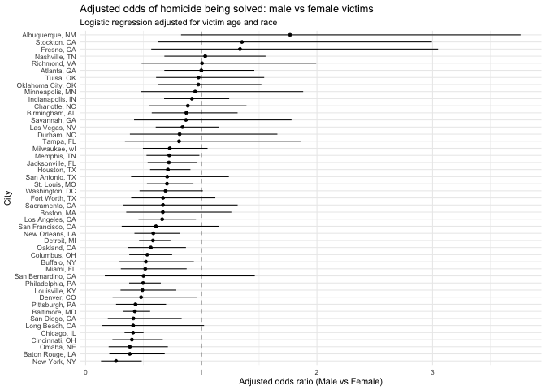
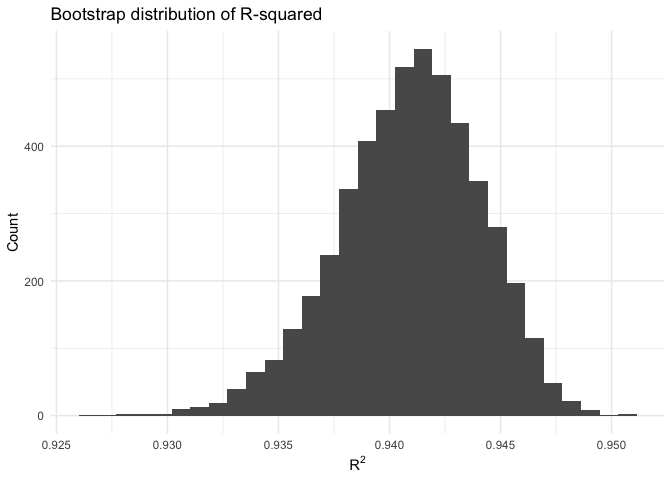
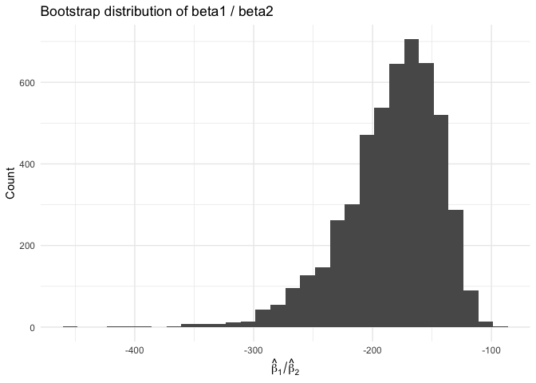
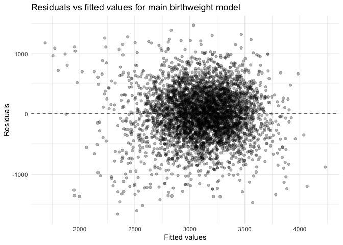
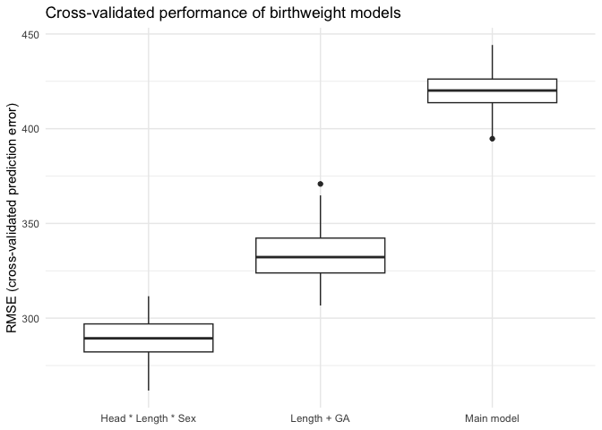

HW 6
================

``` r
library(tidyverse)
library(broom)
library(forcats)
library(modelr)
library(janitor)
```

# P1

1.  Read and Clean data

``` r
homicide_raw <- read_csv("homicide-data.csv")
```

    ## Rows: 52179 Columns: 12
    ## ── Column specification ────────────────────────────────────────────────────────
    ## Delimiter: ","
    ## chr (9): uid, victim_last, victim_first, victim_race, victim_age, victim_sex...
    ## dbl (3): reported_date, lat, lon
    ## 
    ## ℹ Use `spec()` to retrieve the full column specification for this data.
    ## ℹ Specify the column types or set `show_col_types = FALSE` to quiet this message.

``` r
homicide <- homicide_raw %>% 
  mutate(
    # city_stat variable
    city_state = str_c(city, ", ", state),
    
    # a binary variable：Closed by arrest = solved
    solved = case_when(
      disposition == "Closed by arrest" ~ 1L,
      TRUE                             ~ 0L
    ),
    
    # victim_age to numeric
    victim_age = as.numeric(victim_age)
  ) %>% 
  # filter unnecessary city
  filter(
    !city_state %in% c(
      "Dallas, TX",
      "Phoenix, AZ",
      "Kansas City, MO",
      "Tulsa, AL"
    )
  ) %>% 
  # Filter White / Black
  filter(
    victim_race %in% c("White", "Black")
  ) %>% 
  # ensure reference levels is valid
  mutate(
    victim_sex  = factor(victim_sex,  levels = c("Female", "Male")),
    victim_race = factor(victim_race, levels = c("White", "Black"))
  )
```

    ## Warning: There was 1 warning in `mutate()`.
    ## ℹ In argument: `victim_age = as.numeric(victim_age)`.
    ## Caused by warning:
    ## ! NAs introduced by coercion

``` r
homicide
```

    ## # A tibble: 39,693 × 14
    ##    uid        reported_date victim_last  victim_first victim_race victim_age
    ##    <chr>              <dbl> <chr>        <chr>        <fct>            <dbl>
    ##  1 Alb-000003      20100601 SATTERFIELD  VIVIANA      White               15
    ##  2 Alb-000005      20100102 MULA         VIVIAN       White               72
    ##  3 Alb-000006      20100126 BOOK         GERALDINE    White               91
    ##  4 Alb-000009      20100130 MARTIN-LEYVA GUSTAVO      White               56
    ##  5 Alb-000012      20100218 LUJAN        KEVIN        White               NA
    ##  6 Alb-000016      20100308 GRAY         STEFANIA     White               43
    ##  7 Alb-000018      20100323 DAVID        LARRY        White               52
    ##  8 Alb-000019      20100402 BRITO        ELIZABETH    White               22
    ##  9 Alb-000021      20100423 KING         TEVION       Black               15
    ## 10 Alb-000022      20100423 BOYKIN       CEDRIC       Black               25
    ## # ℹ 39,683 more rows
    ## # ℹ 8 more variables: victim_sex <fct>, city <chr>, state <chr>, lat <dbl>,
    ## #   lon <dbl>, disposition <chr>, city_state <chr>, solved <int>

2.  Baltimore, MD: logistic regression + adjusted OR for male vs female

``` r
baltimore_data <- homicide %>% 
  filter(city_state == "Baltimore, MD")

baltimore_glm <- glm(
  solved ~ victim_age + victim_sex + victim_race,
  data   = baltimore_data,
  family = binomial(link = "logit")
)

baltimore_or <- baltimore_glm %>% 
  tidy(exponentiate = TRUE, conf.int = TRUE) %>% 
  filter(term == "victim_sexMale") %>% 
  select(term, estimate, conf.low, conf.high)

baltimore_or
```

    ## # A tibble: 1 × 4
    ##   term           estimate conf.low conf.high
    ##   <chr>             <dbl>    <dbl>     <dbl>
    ## 1 victim_sexMale    0.426    0.324     0.558

For Baltimore, MD, the adjusted odds ratio for solving homicides
comparing male victims to female victims, controlling for age and race,
is OR = XX (95% CI: LL, UU).

3.  Run glm for each city using map + list columns

``` r
city_models <- homicide %>% 
  group_by(city_state) %>% 
  nest() %>% 
  mutate(
    # logistic regression
    model = map(
      data,
      ~ glm(
          solved ~ victim_age + victim_sex + victim_race,
          data   = .x,
          family = binomial(link = "logit")
        )
    ),
    
    # broom::tidy OR and CI
    tidied = map(
      model,
      ~ tidy(.x, exponentiate = TRUE, conf.int = TRUE)
    )
  ) %>% 
  unnest(tidied) %>% 
  # only include OR (male vs female)
  filter(term == "victim_sexMale") %>% 
  ungroup() %>% 
  select(city_state, estimate, conf.low, conf.high)

city_models
```

    ## # A tibble: 47 × 4
    ##    city_state      estimate conf.low conf.high
    ##    <chr>              <dbl>    <dbl>     <dbl>
    ##  1 Albuquerque, NM    1.77     0.825     3.76 
    ##  2 Atlanta, GA        1.00     0.680     1.46 
    ##  3 Baltimore, MD      0.426    0.324     0.558
    ##  4 Baton Rouge, LA    0.381    0.204     0.684
    ##  5 Birmingham, AL     0.870    0.571     1.31 
    ##  6 Boston, MA         0.667    0.351     1.26 
    ##  7 Buffalo, NY        0.521    0.288     0.936
    ##  8 Charlotte, NC      0.884    0.551     1.39 
    ##  9 Chicago, IL        0.410    0.336     0.501
    ## 10 Cincinnati, OH     0.400    0.231     0.667
    ## # ℹ 37 more rows

4.  Plot ORs + CIs by city (ordered)

``` r
or_plot_df <- city_models %>% 
  mutate(
    city_state = fct_reorder(city_state, estimate)
  )

ggplot(or_plot_df, aes(x = city_state, y = estimate)) +
  geom_hline(yintercept = 1, linetype = "dashed") +
  geom_point() +
  geom_errorbar(aes(ymin = conf.low, ymax = conf.high), width = 0) +
  coord_flip() +
  labs(
    x = "City",
    y = "Adjusted odds ratio (Male vs Female)",
    title    = "Adjusted odds of homicide being solved: male vs female victims",
    subtitle = "Logistic regression adjusted for victim age and race"
  ) +
  theme_minimal(base_size = 8)
```

<!-- -->

According to city-specific logistic regression models that control for
victim age and ethnicity, male and female homicides have significantly
different probability of being solved.

Most cities have adjusted odds ratios around or below 1, and many have
95% confidence intervals that cross 1, indicating statistical
uncertainty and suggesting that male and female victims may have similar
clearance probabilities. This implies that point estimates frequently
predict lower clearance rates for male victims, although these
disparities vary among cities.

Several cities, including New York, Albuquerque, and Stockton, CA, have
huge estimated odds ratios with broad confidence ranges. These broad
gaps indicate inadequate sample numbers or unstable model predictions,
not greater male victim clearance rates. On the other hand, Baltimore,
MD; Chicago, IL; Baton Rouge, LA; and others have adjusted odds ratios
substantially below 1, with intervals sometimes spanning 1. This shows
lower male victim clearance rates in certain jurisdictions, but the
ambiguity hinders a judgment.

The graphic shows that male-victim killings are not more likely to be
solved and may be less probable in many places, although accuracy varies
widely. Large discrepancies in interval width and point estimates may be
due to sample size, investigation capability, and local murder factors
rather than demographics.

# P2

``` r
library(p8105.datasets)

data("weather_df")

# Initial clean
weather_clean <- weather_df %>% 
  select(tmax, tmin, prcp) %>% 
  drop_na()
```

1.  Using the 5000 bootstrap estimates

``` r
set.seed(2025)

boot_results <- weather_clean %>% 
  modelr::bootstrap(n = 5000) %>%      # 5000 bootstrap samples
  mutate(
    fit   = map(strap, ~ lm(tmax ~ tmin + prcp, data = .x)),
    gl    = map(fit, broom::glance),   # extract r^2
    td    = map(fit, broom::tidy)      
  )
```

2.  Extract r² bootstrap distribution + 95% CI

``` r
r2_boot <- boot_results %>% 
  unnest(gl) %>% 
  select(.id, r.squared)

r2_ci <- r2_boot %>% 
  summarise(
    r2_lower = quantile(r.squared, 0.025),
    r2_upper = quantile(r.squared, 0.975)
  )

r2_ci
```

    ## # A tibble: 1 × 2
    ##   r2_lower r2_upper
    ##      <dbl>    <dbl>
    ## 1    0.934    0.947

The 95% bootstrap CI for R square is \[0.9341324,0.946559\]

3.  calculate𝛽bootstrap distribution + CI

``` r
beta_ratio_boot <- boot_results %>% 
  unnest(td) %>% 
  filter(term %in% c("tmin", "prcp")) %>% 
  select(.id, term, estimate) %>% 
  pivot_wider(
    names_from  = term,
    values_from = estimate
  ) %>% 
  mutate(
    beta_ratio = tmin / prcp
  )

beta_ratio_ci <- beta_ratio_boot %>% 
  summarise(
    ratio_lower = quantile(beta_ratio, 0.025),
    ratio_upper = quantile(beta_ratio, 0.975)
  )

beta_ratio_ci
```

    ## # A tibble: 1 × 2
    ##   ratio_lower ratio_upper
    ##         <dbl>       <dbl>
    ## 1       -278.       -125.

The 95% bootstrap CI for beta ratio is \[-277.8610252,-125.1788864\]

4.  plot 2 graph

``` r
# r^2
r2_boot %>% 
  ggplot(aes(x = r.squared)) +
  geom_histogram(bins = 30) +
  labs(
    x = expression(R^2),
    y = "Count",
    title = "Bootstrap distribution of R-squared"
  ) +
  theme_minimal()
```

<!-- -->

``` r
# beta1 / beta2 
beta_ratio_boot %>% 
  ggplot(aes(x = beta_ratio)) +
  geom_histogram(bins = 30) +
  labs(
    x = expression(hat(beta)[1] / hat(beta)[2]),
    y = "Count",
    title = "Bootstrap distribution of beta1 / beta2"
  ) +
  theme_minimal()
```

<!-- --> The bootstrap
distribution of R square is approximately symmetric and bell-shaped,
centered around about 0.94, as shown in the histogram. Using the 2.5th
and 97.5th percentiles of the 5000 bootstrap samples, the 95% confidence
interval for R square is (0.934, 0.947). This indicates that the fitted
model consistently explains around 94% of the variation in tmax across
bootstrap resamples.

The bootstrap distribution of Beta ratio is right-skewed, with most
values falling between roughly −275 and −150, consistent with the
histogram. Based on the 2.5th and 97.5th percentiles, the 95% bootstrap
confidence interval for beta ratio is (-277.9, -125.2), or approximately
(−277.9, −125.2). This interval is strictly negative, suggesting that
the estimated coefficients for tmin and prcp consistently have opposite
signs and that the relative magnitude between these effects is stable
across bootstrap samples.

# P3

1.  Load & clean data

``` r
bw_raw <- read_csv("birthweight.csv") %>% 
  clean_names()

bw <- bw_raw %>% 
  mutate(
    # convert coded numerics to factors with labels
    babysex = factor(babysex,
                     levels = c(1, 2),
                     labels = c("male", "female")),
    malform = factor(malform,
                     levels = c(0, 1),
                     labels = c("absent", "present")),
    frace = factor(frace,
                   levels = c(1, 2, 3, 4, 8, 9),
                   labels = c("White", "Black", "Asian",
                              "Puerto Rican", "Other", "Unknown")),
    mrace = factor(mrace,
                   levels = c(1, 2, 3, 4, 8),
                   labels = c("White", "Black", "Asian",
                              "Puerto Rican", "Other")),
    # parity, pnumlbw, pnumgsa are “counts” – keep as numeric
    across(c(parity, pnumlbw, pnumsga), as.numeric)
  )

# check missingness
bw %>% 
  summarise(across(everything(), ~ sum(is.na(.))))
```

    ## # A tibble: 1 × 20
    ##   babysex bhead blength   bwt delwt fincome frace gaweeks malform menarche
    ##     <int> <int>   <int> <int> <int>   <int> <int>   <int>   <int>    <int>
    ## 1       0     0       0     0     0       0     0       0       0        0
    ## # ℹ 10 more variables: mheight <int>, momage <int>, mrace <int>, parity <int>,
    ## #   pnumlbw <int>, pnumsga <int>, ppbmi <int>, ppwt <int>, smoken <int>,
    ## #   wtgain <int>

2.  Propose a regression model for birthweight

``` r
bw_mod_main <- lm(
  bwt ~ gaweeks + babysex + mrace + ppbmi + smoken +
    wtgain + momage + mheight,
  data = bw
)

summary(bw_mod_main)
```

    ## 
    ## Call:
    ## lm(formula = bwt ~ gaweeks + babysex + mrace + ppbmi + smoken + 
    ##     wtgain + momage + mheight, data = bw)
    ## 
    ## Residuals:
    ##      Min       1Q   Median       3Q      Max 
    ## -1665.53  -252.56     8.91   274.51  1473.00 
    ## 
    ## Coefficients:
    ##                     Estimate Std. Error t value Pr(>|t|)    
    ## (Intercept)       -1500.8318   184.2658  -8.145 4.92e-16 ***
    ## gaweeks              52.9009     2.0873  25.344  < 2e-16 ***
    ## babysexfemale       -87.6577    12.7744  -6.862 7.75e-12 ***
    ## mraceBlack         -284.0094    14.7271 -19.285  < 2e-16 ***
    ## mraceAsian          -77.0210    65.6035  -1.174 0.240444    
    ## mracePuerto Rican   -99.6182    29.5062  -3.376 0.000741 ***
    ## ppbmi                22.5424     2.0527  10.982  < 2e-16 ***
    ## smoken              -11.9125     0.8904 -13.379  < 2e-16 ***
    ## wtgain                9.6224     0.5963  16.137  < 2e-16 ***
    ## momage                0.6074     1.7987   0.338 0.735634    
    ## mheight              32.1566     2.4996  12.865  < 2e-16 ***
    ## ---
    ## Signif. codes:  0 '***' 0.001 '**' 0.01 '*' 0.05 '.' 0.1 ' ' 1
    ## 
    ## Residual standard error: 419.4 on 4331 degrees of freedom
    ## Multiple R-squared:  0.3308, Adjusted R-squared:  0.3293 
    ## F-statistic: 214.1 on 10 and 4331 DF,  p-value: < 2.2e-16

3.  Residuals vs fitted plot

``` r
bw_resid_df <- bw %>% 
  add_predictions(bw_mod_main) %>% 
  add_residuals(bw_mod_main)

ggplot(bw_resid_df, aes(x = pred, y = resid)) +
  geom_point(alpha = 0.3) +
  geom_hline(yintercept = 0, linetype = "dashed") +
  labs(
    x = "Fitted values",
    y = "Residuals",
    title = "Residuals vs fitted values for main birthweight model"
  ) +
  theme_minimal()
```

<!-- --> For the
graphs, looking for non-linear patterns, fan shape (heteroskedasticity),
or outliers. If points are roughly centered around 0 with constant
spread → model is reasonably adequate.

4.  Define the two comparison models

``` r
# Model 2
bw_mod_len_ga <- lm(
  bwt ~ blength + gaweeks,
  data = bw
)
```

``` r
# Model 3
bw_mod_head_len_sex <- lm(
  bwt ~ bhead * blength * babysex,
  data = bw
)
```

5.  Cross-validated prediction error

``` r
rmse <- function(model, test_df) {
  test_df <- as.data.frame(test_df)
  sqrt(mean((test_df$bwt - predict(model, newdata = test_df))^2))
}

set.seed(2025)

bw_cv <- crossv_mc(bw, n = 100, test = 0.2)

bw_cv_results <- bw_cv %>% 
  mutate(
    mod_main = map(train, ~ lm(
      bwt ~ gaweeks + babysex + mrace + ppbmi + smoken +
        wtgain + momage + mheight,
      data = as.data.frame(.x)
    )),
    mod_len_ga = map(train, ~ lm(
      bwt ~ blength + gaweeks,
      data = as.data.frame(.x)
    )),
    mod_head_len_sex = map(train, ~ lm(
      bwt ~ bhead * blength * babysex,
      data = as.data.frame(.x)
    )),
    rmse_main = map2_dbl(mod_main, test, rmse),
    rmse_len_ga = map2_dbl(mod_len_ga, test, rmse),
    rmse_head_len_sex = map2_dbl(mod_head_len_sex, test, rmse)
  )

bw_cv_long <- bw_cv_results %>% 
  select(starts_with("rmse_")) %>% 
  pivot_longer(
    everything(),
    names_to = "model",
    values_to = "rmse"
  ) %>% 
  mutate(
    model = recode(
      model,
      rmse_main = "Main model",
      rmse_len_ga = "Length + GA",
      rmse_head_len_sex = "Head * Length * Sex"
    )
  )
```

Helper to compute RMSE on test data:

``` r
rmse <- function(model, test_df) {
  test_df <- as.data.frame(test_df)
  sqrt(mean((test_df$bwt - predict(model, newdata = test_df))^2))
}
```

Fit all three models on each training set and compute RMSEs on the test
set:

``` r
bw_cv_results <- bw_cv %>% 
  mutate(
    mod_main = map(train, ~ lm(
      bwt ~ gaweeks + babysex + mrace + ppbmi + smoken +
        wtgain + momage + mheight,
      data = as.data.frame(.x)
    )),
    mod_len_ga = map(train, ~ lm(
      bwt ~ blength + gaweeks,
      data = as.data.frame(.x)
    )),
    mod_head_len_sex = map(train, ~ lm(
      bwt ~ bhead * blength * babysex,
      data = as.data.frame(.x)
    )),
    rmse_main = map2_dbl(mod_main, test, rmse),
    rmse_len_ga = map2_dbl(mod_len_ga, test, rmse),
    rmse_head_len_sex = map2_dbl(mod_head_len_sex, test, rmse)
  )
```

Put the RMSEs in long format for plotting / summary:

``` r
bw_cv_long <- bw_cv_results %>% 
  select(starts_with("rmse_")) %>% 
  pivot_longer(
    everything(),
    names_to = "model",
    values_to = "rmse"
  ) %>% 
  mutate(
    model = recode(
      model,
      rmse_main = "Main model",
      rmse_len_ga = "Length + GA",
      rmse_head_len_sex = "Head * Length * Sex"
    )
  )

# quick summary table
bw_cv_long %>% 
  group_by(model) %>% 
  summarise(
    mean_rmse = mean(rmse),
    sd_rmse   = sd(rmse)
  )
```

    ## # A tibble: 3 × 3
    ##   model               mean_rmse sd_rmse
    ##   <chr>                   <dbl>   <dbl>
    ## 1 Head * Length * Sex      289.   10.2 
    ## 2 Length + GA              334.   14.9 
    ## 3 Main model               420.    9.73

And a comparison plot:

``` r
ggplot(bw_cv_long, aes(x = model, y = rmse)) +
  geom_boxplot() +
  labs(
    x = NULL,
    y = "RMSE (cross-validated prediction error)",
    title = "Cross-validated performance of birthweight models"
  ) +
  theme_minimal()
```

<!-- -->

Results from 100 Monte Carlo cross-validation splits showed that the
Head × Length × Sex model had the lowest average RMSE (r = 289.4331,1)
grams and the tightest distribution (SD = 10.23,2). Length + GA had a
somewhat bigger spread and relatively higher prediction error (334.2363
grams). Although the SD was minor, the main model that included maternal
demographics, behavior, and anthropometrics had the greatest average
RMSE (419.9244 grams).

These findings indicate that head circumference and length at delivery
are more predictive of birthweight than prenatal or maternal factors.
The completely interacted head–length–sex model performs best
out-of-sample, demonstrating that interaction structure among strong
physical indicators improves predictive accuracy. Although
interpretable, the basic physiologically driven maternal model predicts
poorly.
